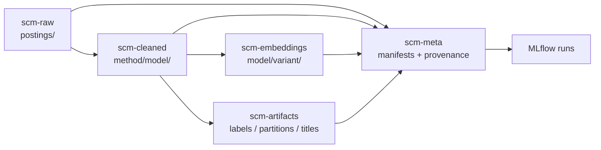

# Data Layout & Object Storage Naming

!!! info "Status — Proposed (2026-09-19)"
    This note defines the target object-storage layout for migrating the local `data/` corpus to S3 as the pipeline becomes MLflow-tracked. It is a convention proposal: bucket names, layer boundaries, and key templates are the contract; implementation (IaC, migration scripts, CI validator) follows in a later step.

## 1. Context

The pipeline currently stores everything as local files under `data/`: raw posting Markdown, a canonical `jobs.json`, LLM run caches, derived labels and partitions, benchmark results, and a NumPy embedding matrix. That layout served experimentation but does not support the production goals:

- **Immutable inputs** — raw postings must never be mutated in place; re-scrapes and re-enrichment need a new version, not an overwrite.
- **Reproducibility** — a cleaned text file is meaningless without the cleaning method and model that produced it, and an embedding vector is meaningless without its embedding model and input variant.
- **Lineage** — `raw → cleaned → embedded → labeled` must be traceable per posting.
- **MLflow tracking** — every pipeline stage becomes a tracked run whose artifacts live at a stable S3 URI.

This note adapts the general conventions surveyed in the [Object Storage Naming Conventions research report](../research-reports/005-object-storage-naming-conventions.md) to this project's actual data.

## 2. Data Taxonomy

Data is organized into six layers, one bucket each. Splitting by layer is deliberate: versioning, encryption, and lifecycle rules are bucket-level settings, so each layer can carry the retention policy it needs.



| Layer / bucket | Contents | Mutability |
|---|---|---|
| `scm-raw` | Original posting Markdown + immutable enriched envelope (parsed sections and metadata) | Immutable — versioning ON, never overwrite |
| `scm-cleaned` | Text variants (`raw`, `regex`, `llm`, `llm-org-context`); cleaning **method and model in the key** | Write-once per method + model |
| `scm-artifacts` | Taxonomy labels, generated titles, semantic partitions, benchmark results | Write-once per run; versioned by taxonomy/model |
| `scm-embeddings` | Vector files (per-posting `.npy` + matrix bundles); **embedding model in the key** | Write-once per model + input variant |
| `scm-meta` | Lineage manifests, model cards, cleaner cards, dataset registry, MLflow pointers | Mutable (small) |
| `scm-eval` | Golden set (manual), QA diff reports | Mostly immutable |

The four layers the pipeline requires at minimum — raw, cleaned, artifacts, embeddings — are covered directly. `scm-meta` is what makes cleaning methods and embedding models durable and discoverable; `scm-eval` isolates hand-maintained ground truth from generated data.

## 3. Bucket Naming

Buckets follow the general template `<org>-<layer>[-<region>][-<env>]`:

```
scm-raw
scm-cleaned
scm-artifacts
scm-embeddings
scm-meta
scm-eval
```

Rules (all enforced by the portability constraints in report §4.1 and provider docs):

- Lowercase letters, digits, and hyphens only; 3–63 characters; start and end alphanumeric.
- No periods (breaks HTTPS virtual-host addressing), no underscores, no IP-shaped names.
- `scm` is the project prefix; append region/account/env (`scm-raw-useast1-<acct>-prod`) when the deployment becomes multi-region or multi-account.
- No PII, secrets, or sensitive business terms in bucket names — bucket names are globally visible and probeable.

## 4. Object Key Naming

Keys read **leftmost-general → rightmost-specific**. The dimensions that matter for querying — the data variant, then the method/model that produced it — lead the key. Posting identity (the slug) is the stable entity. Date partitions use `key=value` pairs (`day=YYYY-MM-DD`, per report §3.2) and are reserved for genuinely time-ordered data.

### 4.1 Raw — `scm-raw`

```
scm-raw/postings/<posting_id>.md                    # original scrape, immutable
scm-raw/postings/<posting_id>.json                  # immutable envelope: sections + provenance metadata
```

The envelope JSON carries the fields that must not leak into key names: `source_url`, `scraped_at` (ISO-8601), `content_hash` (SHA-256 of the `.md`), `company`, `title_raw`, `role_category`. Both objects are write-once; a re-scrape or correction produces a new object (S3 versioning records the history).

### 4.2 Cleaned — `scm-cleaned`

```
scm-cleaned/<method>/<model>/<posting_id>.json
```

| Method segment | Meaning |
|---|---|
| `raw` | Identity baseline — no cleaning (embedding input for the raw baseline) |
| `regex` | Regex boilerplate removal (Experiment 002); model segment is `<none>` |
| `llm` | LLM text extraction (Experiment 003) |
| `llm-org-context` | LLM organizational-context summary |

Examples:

```
scm-cleaned/raw/<none>/bmo-associate-data-scientist.json
scm-cleaned/regex/<none>/bmo-associate-data-scientist.json
scm-cleaned/llm/openai--gpt-5.4-nano/bmo-associate-data-scientist.json
scm-cleaned/llm-org-context/openai--gpt-5.4-nano/bmo-associate-data-scientist.json
```

Each JSON body records: `posting_id`, `method`, `model`, `prompt_hash`, `raw_hash`, `cleaned_at`, `usage` (token counts), and the `text`.

### 4.3 Artifacts — `scm-artifacts`

```
scm-artifacts/labels/<taxonomy-version>/<model>/<posting_id>.json
scm-artifacts/titles/<taxonomy-version>/<model>/<posting_id>.json
scm-artifacts/partitions/<method>/<model>/<posting_id>.json
scm-artifacts/benchmarks/<experiment>/<day=YYYY-MM-DD>/<model>/<run>.json
```

Embedding the taxonomy version in the key means re-labeling under a new taxonomy never clobbers existing labels:

```
scm-artifacts/labels/ml-ai-v13/openai--gpt-5.4-nano/affirm-ai-solutions-engineer.json
scm-artifacts/partitions/llm/openai--gpt-5.4-nano/bmo-associate-data-scientist.json
scm-artifacts/benchmarks/004-speed-bench/day=2026-07-27/openai--gpt-5.4-nano/run-0.json
```

### 4.4 Embeddings — `scm-embeddings`

```
scm-embeddings/<model>/<input-variant>/<posting_id>.npy
scm-embeddings/<model>/<input-variant>/matrix/<day=YYYY-MM-DD>/<dataset>-<n>-postings.npy
```

The `input-variant` mirrors the cleaned variant (`raw`, `regex`, `llm-openai--gpt-5.4-nano`), so the cleaning → embedding lineage is readable from the key alone. Per-posting vectors are the canonical incremental form; the matrix bundle is the convenience artifact logged to MLflow for a full pipeline run.

```
scm-embeddings/sentence-transformers--all-MiniLM-L6-v2/llm-openai--gpt-5.4-nano/bmo-associate-data-scientist.npy
scm-embeddings/sentence-transformers--all-MiniLM-L6-v2/raw/matrix/day=2026-07-22/raw-27-postings.npy
```

**Model-id normalization:** replace `/` and `:` with `--` so a model identifier stays a single valid path segment (`openai/gpt-5.4-nano` → `openai--gpt-5.4-nano`). The canonical, unmodified model string is stored in the object body and in the model card.

### 4.5 Metadata & lineage — `scm-meta`

```
scm-meta/models/<model-id>.json                      # embedding model card (dim, tokenizer, normalization)
scm-meta/methods/<method>-<model>.json               # cleaning method card (prompt hash, params)
scm-meta/datasets/<day=YYYY-MM-DD>/manifest.json     # snapshot contents + content hashes
scm-meta/provenance/<posting_id>.json                # raw_hash → clean variant → embedding → labels
scm-meta/mlflow/<experiment>/<run_id>.json           # pointer between S3 URIs and MLflow runs
```

### 4.6 Evaluation — `scm-eval`

```
scm-eval/golden/partitions/<posting_id>.json         # hand-maintained golden set
scm-eval/diffs/<method>/<model>/<posting_id>.txt     # raw-vs-clean QA reports
```

## 5. Documenting Cleaning Methods and Embedding Models

The requirement "the method of cleaning needs to be documented" and "the embedding model also needs to be documented" is satisfied in three redundant places, so provenance survives independently of any one record:

1. **In the key** — method/model are path segments, so a plain `aws s3 ls` reveals how an artifact was produced.
2. **In the object body and S3 object metadata** — `method`, `model`, `prompt_hash`, `raw_hash`, `cleaned_at`, `usage`.
3. **In `scm-meta/` cards** — the cleaner card holds the full prompt and parameters; the model card holds dimensions, tokenizer, and normalization. Both are referenced by MLflow run parameters.

A content-addressed cache key (`raw_hash` + `prompt_hash` + `model`) makes re-runs idempotent and lets a manifest prove that a stored cleaned text corresponds to a specific raw input.

## 6. Migration Mapping

| Current local artifact | Target S3 key |
|---|---|
| `data/selected-job-postings/<file>.md` | `scm-raw/postings/<posting_id>.md` |
| `data/jobs.json` | Per-posting envelopes `scm-raw/postings/<posting_id>.json` + `scm-meta/datasets/<day>/manifest.json` |
| `data/.llm_clean_cache.json` / `_v2.json` | `scm-cleaned/llm/openai--gpt-5.4-nano/<posting_id>.json` (v1/v2 → distinct method cards) |
| `data/.llm_org_context_cache.json` | `scm-cleaned/llm-org-context/openai--gpt-5.4-nano/<posting_id>.json` |
| `data/005_semantic_partitions.json` | `scm-artifacts/partitions/llm/openai--gpt-5.4-nano/<posting_id>.json` |
| `data/006_taxonomy_labels.json` | `scm-artifacts/labels/ml-ai-v13/openai--gpt-5.4-nano/<posting_id>.json` |
| `data/golden_cleaned.json` | `scm-eval/golden/partitions/<posting_id>.json` |
| `data/004_benchmark_results.json` | `scm-artifacts/benchmarks/004-speed-bench/day=2026-07-27/<model>/run-<n>.json` |
| `data/raw_embeddings.npy` | `scm-embeddings/sentence-transformers--all-MiniLM-L6-v2/raw/matrix/day=2026-07-22/raw-27-postings.npy` |
| `data/.diff_clean.txt` / `.diff_raw.txt` | `scm-eval/diffs/<method>/<model>/<posting_id>.txt` |
| `data/plots/*.png` | Not migrated — experiment output; log as MLflow run artifacts |
| `data/.llm_*cache*.json`, `data/.005/006_*cache.json` | Not migrated — ephemeral API caches; keep local or in a scratch prefix |

!!! warning "Reconcile the corpus before migrating"
    Raw posting files and the canonical dataset can drift. At the time of writing, `data/selected-job-postings/` contains files not yet present in `data/jobs.json` (for example the `rbc-ai-engineer` and `scotiabank-ai-software-engineer` postings). Manifest generation must report this reconciliation explicitly so every raw posting is either ingested or consciously excluded — never silently dropped.

## 7. MLflow Alignment

Keep S3 key segments and MLflow run parameters **identical and greppable** so an artifact URI or a run ID each resolves to the other:

| MLflow parameter | S3 key segment |
|---|---|
| `cleaning_method` | `scm-cleaned/<method>/` |
| `cleaning_model` | `scm-cleaned/<method>/<model>/` |
| `embedding_model` | `scm-embeddings/<model>/` |
| `input_variant` | `scm-embeddings/<model>/<input-variant>/` |
| `taxonomy_version` | `scm-artifacts/labels/<taxonomy-version>/` |

Each MLflow run logs its produced objects as artifacts and writes a pointer to `scm-meta/mlflow/<experiment>/<run_id>.json`. This makes any embedding or label reconstructable from the tracking server plus the data lake, with no reliance on local files.

## 8. Lifecycle & Retention

| Bucket | Versioning | Retention / lifecycle |
|---|---|---|
| `scm-raw` | ON | No expiration; consider Object Lock; transition to cold storage after several years |
| `scm-cleaned` | ON | No expiration — reproducibility depends on it |
| `scm-artifacts` | ON | Prefix-based transitions for `benchmarks/` and `diffs/` only |
| `scm-embeddings` | ON | No expiration while the model is supported; archive when a model is retired |
| `scm-meta` | ON | Retain cards, manifests, provenance permanently; expire scratch prefixes |
| `scm-eval` | ON | Golden set immutable; diff reports may expire by prefix |

Because lifecycle rules and versioning are bucket-level, this split is what allows raw data to be locked down while ephemeral QA output expires.

## 9. Security

- **Names are public.** Keys contain only lowercase slugs (company + role) — no URLs, emails, or PII. Sensitive metadata lives in the envelope body and object metadata.
- **Block public access** on all buckets; encrypt at rest (SSE-KMS) and in transit.
- **Least privilege by prefix.** Grant each pipeline stage write access only to its layer prefix (ingestion → `scm-raw/`, cleaning → `scm-cleaned/`, embedding → `scm-embeddings/`).
- **Enforce the standard at creation time.** A CI validator checks bucket/key strings against the templates in this note; in a multi-account setup, IAM/SCP conditions can constrain `s3:PutObject` to the permitted prefixes.

## 10. Scalability

At the current corpus size (tens of postings) no performance-specific key tricks are needed. The only forward-looking decisions already encoded here:

- Time-ordered, append-heavy data (`benchmarks/`, `diffs/`, caches) is naturally spread by its date prefix, matching report §5.2.
- If ingestion ever streams at high request rates to a single prefix, prepend a short entropy hash before the logical key — **except** in S3 directory buckets / hierarchical namespaces, where entropy prefixes are counterproductive (report §5.3).
- Per-posting objects keep writes independent and incremental, so adding one posting never rewrites a shared blob.

## 11. Validation Checklist

Before creating a bucket or writing a key:

- [ ] Bucket is lowercase, hyphenated, 3–63 chars, starts/ends alphanumeric
- [ ] Key follows `<domain>/<variant>/<model>/<posting_id>.<ext>`
- [ ] Method, model, and taxonomy version are present in the key where applicable
- [ ] Model ids normalized (`/`, `:` → `--`); canonical string stored in the body
- [ ] No PII, secrets, or URLs in bucket or key names
- [ ] Date partitions only on time-ordered data, in `key=value` form
- [ ] Object is immutably written; corrections create a new version
- [ ] `scm-meta` manifest updated and MLflow parameters match the key segments

## 12. References

1. [Object Storage Naming Conventions research report](../research-reports/005-object-storage-naming-conventions.md) — provider rules and general best practices this layout adapts
2. [Design Decisions](design-decisions.md) — pipeline architecture the layout serves
3. [Experiment Log](../experiments/index.md) — provenance of cleaned text, partitions, and taxonomy labels
