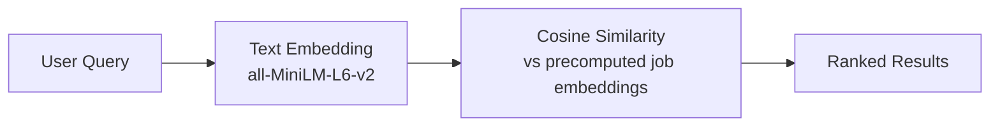

# Demo

!!! info "Demo Coming Soon"
    The interactive demo is under development. The FastAPI backend and frontend are planned for Phases 4 and 7 of the [project scope](project.md).

## Planned Interface

<div style="display: flex; gap: 1em;" markdown="1">

```
┌──────────────────────────────────────────────┐
│  Enter a resume or describe your skills, │
│  interests, and experiences.             │
│                                          │
│  [ Search ]                              │
│                                          │
│  ─────────────── Results ────────────────  │
│  ┌───────────────────────────────────────┐  │
│  │ 1. Senior ML Engineer         0.94  │ │
│  │    Company XYZ                      │ │
│  │    Python, PyTorch, AWS, CI/CD…     │ │
│  ├────────────────────────────────────────┤ │
│  │ 2. Data Scientist             0.89  │ │
│  │    Company ABC                      │ │
│  │    SQL, Spark, ML pipelines…        │ │
│  ├────────────────────────────────────────┤ │
│  │ 3. MLOps Engineer             0.85  │ │
│  │    Company DEF                      │ │
│  │    Kubernetes, Docker, MLflow…      │ │
│  └────────────────────────────────────────┘ │
└──────────────────────────────────────────────┘
```

```
┌──────────────────────────────────────────┐
│  UMAP Career Map                     │
│                                      │
│    ·   SWE      ·  DevOps            │
│        ·  ··  ·                      │
│   ·  ·      ·    ★ ML Engineer      │
│               ·   ★ Search   ·      │
│     ·  Data Eng  ·                   │
│  ·    ··   ·      ·  PM              │
│     ·      · ···                     │
│         ·    ·  · UX                 │
│  ·   ·        ·                      │
│     · · Data Sci  · Security         │
│                                      │
│  ★ = Your search result             │
│  · = Other careers                   │
└──────────────────────────────────────────┘
```

</div>

## Example Queries

**Query:** "I'm interested in data science and have focused a lot of data engineering, feature engineering, and unsupervised/weakly-supervised learning tasks where there is no ground truth usable to train models. I'm not really that interested in Agentic AI, but am willing to use it. I like high-dimensional linear algebra, optimizing algorithm performance using multithreading and low-level programming concepts, and hard engineering problems. I lack experience with model deployment, PyTorch/deep learning, and  model maintenance, but can easily obtain it due to my background in Mathematics. What kind of jobs would be a good fit for me?"

**Expected behavior:** Map the user's query to job families in an interactive UMAP plot. Show a ranking of best-match roles with lists of required skills. Roles with different titles but overlapping skill requirements should both rank highly. 

<!-- ## How the Demo Works



The user's resume or text query is embedded using `all-MiniLM-L6-v2` (384-dimensional, L2-normalized). The query vector is compared against precomputed job posting embeddings via cosine similarity (implemented as dot product on normalized vectors). The top-k most similar postings are returned ranked by score.

## API Endpoints (Planned)

| Method | Endpoint | Description |
|---|---|---|
| `POST` | `/upload-resume` | Accept text or PDF resume, generate embedding, return ranked jobs |
| `POST` | `/search` | Query by text, return top-k matches with similarity scores |
| `GET` | `/jobs` | List all jobs with metadata and embeddings |
| `GET` | `/jobs/{id}` | Single job details |

## Where Things Stand

The embedding pipeline and similarity search are functional. Three experiments (baseline, boilerplate removal, LLM extraction) have been completed. The FastAPI backend is the next major deliverable. Current functionality can be explored through the [Experiment Log](experiments/index.md) and [Results](results.md) pages. -->
