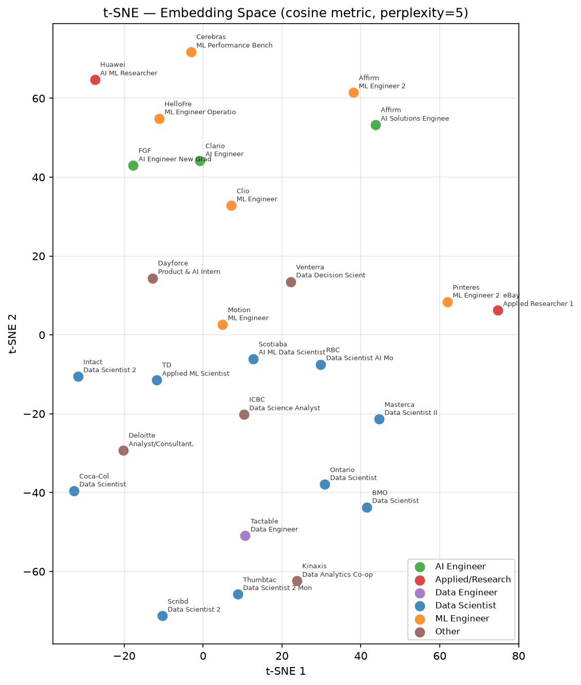

# Experiment 001 — Baseline Embedding

**Date:** July 22, 2026

Results for baseline implementation of the shared semantic space using SentenceTransformers.

AI was used for rapid prototyping.

## Experimental Design

- 27 job postings were selected from LinkedIn (and 1 from Indeed) and their content pasted into markdown files in `data/selected-job-postings`.
- A baseline embedding and visualization was implemented in `scripts/001_baseline/bootstrap.py`, which extracts key metadata from each posting with the following schema:

```
"id": posting_id,
"title_raw": title,
"company": company,
"source_file": filepath.name,
"role_category": role_category,
"sections": sections,
"raw_full_text": text,
```

- The raw full text was embedded using `all-MiniLM-L6-v2` into a 384-dimensional dense embedding space, and normalized to the unit sphere.
- PCA, UMAP, and t-SNE visualizations were used, coloured by role category and annotated by company and job title.

## Results

### PCA


- PCA shows a 2D subspace of the high-dimensional embedding space spanning the first two orthogonal axes holding the greatest variance.
    - All points are projected down to this subspace.
- There appears to be some weak clustering of the ML Engineer postings (orange).
- Data scientist roles (blue) are spread all over the place, varying most among the first principal component.
    - Embedding dimensions are meaningless, so there are no useful factors to extract here.
- "Other" (brown) roles show signs of weak clustering around the origin, but they are not well-defined enough for meaningful analysis.
- AI Engineer (green) roles also show signs of clustering around (PC1, PC2) = (0.15, -0.1)

- Data Scientist roles are known (anecdotally, from LinkedIn) to have a lot of overlap with ML Engineer roles, which may explain their large variance across the PCA embedding.
- **This directly motivates the need for more detailed taxonomies for each posting and derive job categories separately from the job posting.**

### UMAP


- UMAP (uniform manifold approximation and projection) finds a high-dimensional Riemannian manifold "close" to the data and projects it down to 2 dimensions.
    - By using Riemannian manifolds, the hope is to preserve local neighborhood structure.
- The clustering results are similar.
- AI Engineer roles (green) appear to be clustered. These roles involve agentic work, which might carry significantly different semantic meanings from other roles.
- Research roles (red) are very far apart.
    - The eBay Applied Researcher 1 listing describes search ranking as a primary responsibility.
    - Huawei's AI/ML Researcher mentions multimodal model development and integration.
    - It might be typical for research roles to be very different in scope.
- Interestingly, Data Scientist roles (blue) appear to have more meaningful clustering structure.
    - They vary most along the second UMAP axis (locally orthogonal?).
    - Again, embedding space dimensions are meaningless so we cannot infer semantic relationships from them.
- The rest (ML Engineer, Other) show weak clustering.
- More sample points and a more refined taxonomy may improve interpretation results.

### t-SNE



- t-SNE (t-distributed stochastic neighbour embedding) calculates the pair-wise Euclidean distance between every point in the embedding space and uses it to construct a Gaussian distribution for each point's local neighborhood, capturing local structure.
    - It then uses the probability distribution to map the high-dimensional points down to a lower one, while choosing lower-dimensional one through minimizing the Kullback-Leibler divergence.
    - The resulting visualization preserves local structure but distorts global relationships and complicates interpretation.
- This visualization appears weakest of the three.
- Data Scientist roles (blue) surprisingly exhibit the greatest clustering, being arranged roughly in the perimeter of a circle centered around (0,-40).
- Actually, all other roles appear scattered in rough clusters with around the same diameter.
    - The only exception are the Applied/Research roles, which again show large separation.
    - Interestingly, the closest neighbour to the eBay search ranking role is the Pinterest ML Engineer role, which also involves search ranking.
    - Not sure if the HelloFresh ML Engineer role (Agentic AI) bears much semantic similarity to the Huawei researcher (Multi-modal AI) role though.

## Discussion

- One major limitation of this experiment is that the embedded text is not engineered at all.
    - There are several passages of text not related to the work responsibilities, for example the "About Us" or "Company Culture" sections that discuss company values, benefits, and general information unrelated to the specific job duties being advertised.
    - The presence of these non-essential sections may dilute the semantic signal of the actual job responsibilities, potentially causing the embeddings to cluster based on company culture rather than technical role requirements.
    - This suggests that a preprocessing step to extract only the "Responsibilities" and "Requirements" sections would likely improve the discriminative power of the embeddings.
- Another limitation is the small sample size of 27 postings, which may not capture the full diversity of AI/ML roles across different industries and company sizes, limiting the generalizability of the findings.
    - We would require either **many more postings scraped from the internet, or simulated job postings generated from the real ones**, or something like that.
- A smaller limitation is the use of a single embedding model, but feature engineering is likely to have a larger impact than trying different models at this time.
- One final limitation is the spread of actual responsibilities across similar or (seemingly) unrelated job titles.
    - This motivates the generation of a more granular taxonomy that can better capture the semantic relationships.

- **3-dimensional visualizations** may also be interesting at some point, but likely unnecessary at the present state of the work, especially since embedding dimensions are not semantically meaningful.

## Questions

- Conceptual underpinnings of UMAP and t-SNE are modest and not complete. Not quite necessary at this time but a notable gap for future development.

## Follow-ups

- Taxonomy of AI/ML roles and responsibilities produced at `docs/research-reports/ml-ai-responsibility-taxonomy.md`
    - AI-generated research report enumerating different responsibilities for AI/ML jobs and collecting them under different role labels independently of job postings.
- **Feature engineering** from the job postings for improved embedding quality
    - Perhaps keyword extraction, per-section analysis, removal of non-essential content (e.g., company culture sections), normalization of text, LLM-generated summaries
        - **LLM evals** may one day become necessary...
