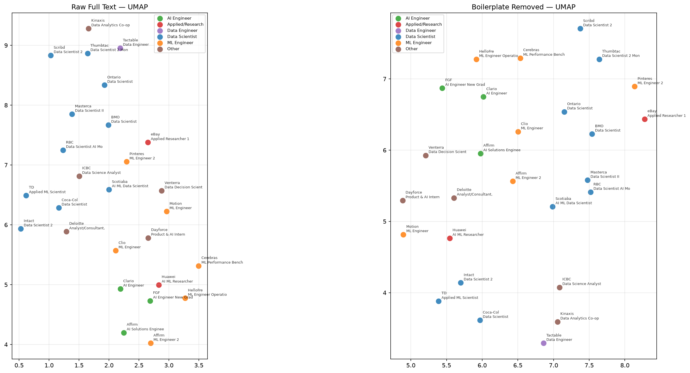

# Experiment 002 — Boilerplate Removal

**Date:** July 22, 2026

This experiment tests the effect of removing non-essential content (company culture, about us, etc.) from job postings before embedding.

**Hypothesis:** Embedding of only the body text should improve cluster separation and reduce noise from unrelated company information.

## Experimental Design

- The `jobs.json` contains parsed job postings with fields per-section (title, responsibilities, requirements, company culture, etc.)
- Only the `responsibilities` and `requirements` sections are concatenated for embedding, excluding `company_culture`, `about_us`, and other non-essential sections.
    - A `clean_text` field was added to the JSON structure containing the concatenated body text.
    - Only the following fields were kept:
    ```
    KEEP_SECTIONS = ["about_role", "responsibilities", "qualifications", "nice_to_have"]
    ```
- The same embedding pipeline is used as in the baseline experiment (all-MiniLM-L6-v2, L2-normalized), but applied to the cleaned text.
- UMAP, PCA and t-SNE visualizations are generated for direct comparison against the baseline embeddings.
- `scripts/002_boilerplate/diff_raw_vs_clean.py` is used to generate raw and clean_text files diff-able with VSCode.

## Results

- Results are improved but unfortunately not satisfactory.
    - Remaining text still includes non-job related content, such as benefits or company culture information.
    - The boilerplate removal regex patterns fail to capture all variations of these sections across different posting formats.
- Visualizations do show improvement in cluster separation compared to the baseline however, with less overlap remaining between role categories.

### PCA


- Interestingly, the PCA plot seems to put the Data Scientist roles and all the other roles on two orthogonal axes. Very interesting!
    - I wonder what this means. So far we've worked under the assumption that there is no meaning to the dimensions in the embedding space.
    - However, PCA does reveal that the first two principal components capture the most variance in the data, and the orthogonal arrangement suggests that different role categories may be distinguished by distinct semantic features captured along these axes.

### UMAP



- UMAP seems to also capture more meaningful separation between groups.
- Data Scientist roles (blue) occupy a diagonal band across the plot. Not sure if this is better or worse.
    - Clustering performance seems worse but the separation between distinct role categories appears improved.

### t-SNE


- t-SNE performance remains the poorest of the three. No discernible structure gained, although the embedding appears to span a larger area than in the baseline.

## Discussion

- Early results suggest that removing non-essential content improves cluster separation and reduces noise from unrelated company information.
- But the boilerplate removal step is brittle, depending on complicated regex and pre-determined section extraction that may not scale to real-world job posting variance.
    - At the present moment, it doesn't even clean up all the unwanted text.
- Switching early to an **LLM extraction-based workflow** to automatically identify and extract relevant sections (responsibilities, requirements) from unstructured job postings.
