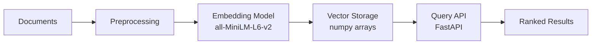

# AI/ML Career Map

A semantic search tool for mapping your interests and experience to actual job families in AI and machine learning, based on skills and not title.

<!-- --- -->

-   **Problem**

    ---

    Traditional job searches struggle when *responsibilities don't match the title*. 
    
    A "Machine Learning Engineer" won't match an "Applied Scientist" role, even when the work is identical.

    How do you find the jobs families that are right for you? 

-   **Solution**

    ---

    Dense text embeddings provide *semantic clustering of job postings* based on responsibilities.

    Clustering and similarity rankings *map your interests to job families* based on skills and experience.

    Dimension-reduction tools provide *intuitive 2D visualizations* of high-dimensional spaces.

<!-- -   :material-pipe:{ .lg .middle } **System** -->

<!-- --- -->

<!-- Embedding pipeline → vector index → similarity search → API service. Precomputed embeddings with L2 normalization enable dot-product similarity at query time — no GPU required. -->

<!-- -   :material-chart-bar:{ .lg .middle } **Evaluation** -->

<!-- --- -->

<!-- Quantitative retrieval benchmarks: self-retrieval (100%), separation gap (+0.0493, LLM-cleaned). pytrec_eval integration planned for Precision@5, MRR, NDCG. -->

[Launch Demo](demo.md){ .md-button .md-button--primary }
<!-- [View Source Code](https://github.com/moonuel/semantic-career-map){ .md-button .md-button--warn } -->

<!-- 
---

## Architecture Preview

[:material-arrow-right: Full architecture documentation](architecture.md)

---

## Current Status

| Phase | Description | Status |
|---|---|---|
| 1 | Preprocessing & Embedding Optimization | :material-progress-check: Baseline embedding + visualization complete (27 postings). Experiment loop next. |
| 2 | Data Collection & Ingestion | :material-progress-check: 27 postings collected. Non-ML postings planned for contrast. |
| 3 | Embedding Pipeline & Similarity Engine | :material-close: Not started |
| 4 | FastAPI Backend | :material-close: Not started |
| 5 | Docker Containerization | :material-close: Not started |
| 6 | Cloud Deployment | :material-close: Not started |
| 7 | Frontend | :material-close: Not started |
| 8 | CI/CD Pipeline | :material-close: Not started |
| 9 | Documentation & Polish | :material-close: Not started |

### Phase 1 Progress

- ✅ Steps 1.0–1.2: Parsed → embedded (all-MiniLM-L6-v2, L2-normalized) → PCA + UMAP visualized
- ✅ Steps 1.4–1.7: Experiment loop — baseline, boilerplate removal, LLM extraction complete
- 🔜 Step 1.3: Proxy metrics formalization, nearest-neighbor audit
- 🔜 Steps 1.6–1.7: Skill extraction, weighted concatenation experiments -->
