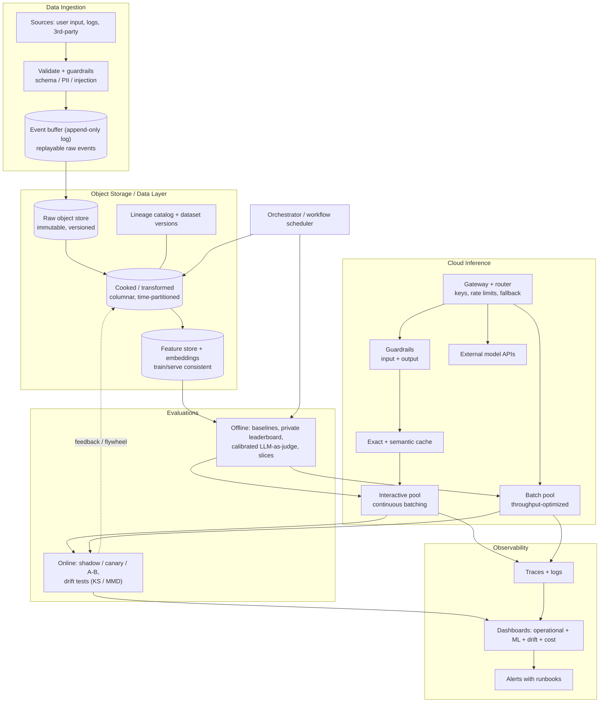

# Proposed System Architecture — Research Report

> Synthesized from Chip Huyen, *Designing Machine Learning Systems* (DMLS, O'Reilly 2022) and
> *AI Engineering* (AIE, O'Reilly 2025). This is a **proposal for discussion**, not an
> implementation record. It is generic by design: it describes the target shape before any repo
> specifics are folded in.

---

## 1. Executive Summary

DMLS and AIE describe two halves of the same problem. DMLS is about *building applications on top
of traditional ML models* — tabular data, annotations, feature engineering, model training, and the
production infrastructure around them. AIE is about *building applications on top of foundation
models* — prompt engineering, context construction, retrieval, and parameter-efficient finetuning.
A system that embeds text, retrieves, and reasons sits in both worlds, so this proposal draws the
architecture from both books.

Five principles from the books govern every decision below:

1. **Business objective → ML objective → technical metric** (DMLS Ch. 2). If a metric does not move
   a business metric, it is noise.
2. **The system, not the model, is the unit of design** (DMLS Ch. 2). Requirements are reliability,
   scalability, maintainability, and adaptability.
3. **The lifecycle is an iterative loop, not a pipeline** (DMLS Ch. 2, Ch. 9). Production data must
   flow back into training data — a data flywheel (AIE Ch. 8).
4. **Evaluation is the primary engineering discipline** (AIE Ch. 3–4). Define criteria before
   building; treat evaluation as a pipeline you design, calibrate, and monitor.
5. **Inference is a queue problem, not a compute problem** (AIE Ch. 9). Scheduling — batching,
   caching, routing — dominates raw hardware for both latency and cost.

**Recommended shape in one paragraph:** a decoupled, validated ingestion boundary that lands
immutable raw events in an append-only buffer; versioned columnar object storage under a lineage
catalog as the system of record, with features/materialized embeddings in a shared feature store;
an evaluation pipeline spanning offline (baselines, private leaderboard, calibrated LLM-as-judge)
and online (shadow/A-B, drift detection); a gateway-fronted inference layer with routing,
guardrails, and caching over latency-optimized and throughput-optimized pools; and an observability
surface built for decisions and runbooks, not decoration.

---

## 2. Design Principles Carried Over

### 2.1 Business objective → ML objective → technical metric

DMLS Ch. 2 insists every ML project begins with *why*. Most businesses do not care about ML
metrics unless they move business metrics, so each technical metric must trace back through an ML
objective to a business objective. This is the test that should reject any proposed component: if
it cannot be tied to a decision or a business outcome, it is infrastructure for its own sake.

### 2.2 A system, not a model

The four general system requirements (DMLS Ch. 2) are the acceptance criteria for this architecture:

| Requirement | What it means here |
|---|---|
| **Reliability** | Correct behavior under expected and unexpected conditions; graceful degradation when a model or dependency fails |
| **Scalability** | Grows with data volume and request rate without redesign — horizontal at the serving layer, partitioned at the storage layer |
| **Maintainability** | Multiple people can work on it; standardized environments; versioned artifacts; automated workflows |
| **Adaptability** | Can respond to distribution shift and requirement change without a rewrite |

### 2.3 The data flywheel

DMLS Ch. 9 and AIE Ch. 8 both reject the one-way pipeline. New production data must be usable to
improve the system, which means the architecture needs a *deliberate path back*: logged
interactions → labels/feedback → evaluation sets → retraining or prompt/retrieval updates →
re-deployment. Designing a static pipeline with no return path is the most common architectural
mistake the books warn against.

### 2.4 Evaluation-driven development

AIE Ch. 4: evaluation is the biggest blocker to AI adoption, and defining criteria up front is what
unblocks it. The architecture must make evaluation cheap and continuous, not an afterthought bolted
on before launch.

### 2.5 Inference as queue theory

AIE Ch. 9 frames the serving layer as a queue over a scarce resource. When latency or cost
surprises you, "draw the queue first — arrival rate, service time, queue depth — before touching
the model." This reframes serving optimization as scheduling, not math.

---

## 3. Data Ingestion

### 3.1 Three modes of dataflow (DMLS Ch. 3)

DMLS Ch. 3 identifies exactly three ways data moves between processes, and the architecture should
pick consciously rather than default by accident:

| Mode | Latency | Coupling | Use for |
|---|---|---|---|
| **Through databases** | Low | Service-coupled | OLTP writes, transactional state |
| **Through services** (APIs) | Low–medium | Tightly coupled | Request/response features, synchronous lookups |
| **Through real-time transports** (Kafka, RabbitMQ) | Low, asynchronous | Decoupled | Event ingestion, logs, feedback signals |

The recommended default for ingestion is the **real-time transport as an append-only log**, because
it decouples producers from consumers and gives a replayable source of truth. Services remain the
mode for synchronous feature lookups at serving time.

### 3.2 Recommended ingestion boundary

1. **Capture raw first, transform later.** Land every event in the buffer unmodified. A single
   source of truth can be re-read for backfills and debugging; neither is possible if the first
   consumer is also the transformer.
2. **Validate and guard at the boundary.** DMLS Ch. 8's most-cited failure is *production data that
   differs from training data*; user input is malformatted and needs thorough validation. Validate
   types, ranges, null patterns, and shape on entry. AIE Ch. 10 adds **input guardrails** on user
   data — PII masking and prompt-injection detection — *before* anything reaches a model.
3. **Separate raw from cooked.** Raw is immutable and archived; cooked is validated, transformed,
   and versioned. This is the boundary that becomes the dataset-engineering step of AIE Ch. 8.
4. **Batch is a special case of stream.** DMLS Ch. 3 notes stream engines can unify both; start
   batch, add streaming when feedback latency demands it (Ch. 9: training can be batch, but *online*
   evaluation requires streaming).
5. **Track lineage from the first byte.** DMLS Ch. 5 lists "keep track of your data's lineage" as a
   best practice; it is far cheaper to record provenance at ingestion than to reconstruct it later.

### 3.3 Online vs. offline split

DMLS Ch. 7 distinguishes online (low-latency, responsive, latency-critical) from batch (higher
latency, flexible-less) prediction. Ingestion must feed both: a low-latency path for features
needed at request time, and a bulk path for training and offline evaluation. The two paths must
share the same transformation logic, or train/serve skew is guaranteed.

---

## 4. Object Storage

### 4.1 Format by access pattern (DMLS Ch. 3)

DMLS Ch. 3's central storage lesson is that format follows access pattern:

- **Column-major, binary formats** (Parquet, ORC, Avro) for analytical and ML access, where whole
  features are read across many rows. Row-major is for point lookups/OLTP.
- **Text vs. binary** is a readability-vs-size/performance trade; for large ML datasets, binary
  columnar wins decisively.
- **Storage engines are chosen by processing type** — transactional (OLTP) vs. analytical (OLAP) —
  but the modern trend DMLS highlights is *decoupling storage from processing*, so the same
  underlying objects serve both.

### 4.2 Object storage as the system of record

The recommended pattern is **object storage (S3-compatible) as the durable source of truth**,
with warehouses, catalogs, and indexes as rebuildable *logical* layers on top. This directly
follows DMLS Ch. 10's observation that storage/compute is commoditized and should be decoupled.

Concretely:

- **Immutable, versioned objects.** Enables reproducibility and replay.
- **Per-layer separation of concerns.** Versioning, encryption, access policy, and lifecycle are
  bucket-level settings, not prefix-level, so layers with different requirements belong in
  different buckets (and this is the same reasoning captured in the object-storage naming report,
  `005-object-storage-naming-conventions.md`, which should remain the naming standard).
- **A lineage catalog over the store.** A data lake without governance becomes a swamp (DMLS
  Ch. 3/10). The catalog is what prevents that.

### 4.3 The feature store (DMLS Ch. 10)

DMLS Ch. 10 names three tools as essential to an ML platform: deployment, **model store**, and
**feature store**. The feature store is the shared layer that computes features once, reuses them
across models, and — critically — guarantees *train/serve consistency*. Recommended placement:
source-of-truth feature values and embedding vectors live in object storage; they are *materialized*
into a low-latency serving index (vector index, key-value cache) rather than duplicated as
authoritative state. The model store holds versioned model/artifact metadata and ties each
deployment to the exact data and code revision that produced it.

### 4.4 Storage decision table

| Data | Format / engine | Notes |
|---|---|---|
| Raw events / logs | Append-only log buffer + compressed columnar archive | Immutable, replayable, cheap retention |
| Processed features | Columnar (Parquet) partitioned by time | Time-based partitions align with lifecycle rules |
| Embedding vectors + metadata | Binary vectors + relational metadata in object store | Materialized into a vector index for serving |
| Model artifacts + prompts/config | Versioned object store (model store) | Every version tied to code/data revision |
| Serving-time features | Low-latency store, materialized | Must share transformation logic with training |

---

## 5. Evaluations

Evaluation is where AIE is strongest and where the two books most usefully diverge: DMLS treats
offline evaluation as model selection, while AIE treats evaluation as a first-class product
discipline spanning criteria, selection, and a designed pipeline.

### 5.1 Always establish a baseline (DMLS Ch. 6)

"Evaluation metrics don't mean much unless you have a baseline to compare them to." Baselines may be
random, a simple heuristic, a human baseline, or the previous production model. Use **time-based
splits**, never random, to avoid leakage (DMLS Ch. 5), and scale features using train-split
statistics only.

### 5.2 Define criteria in four buckets first (AIE Ch. 4)

AIE Ch. 4 buckets evaluation criteria into: **domain-specific capability**, **generation
capability** (factual consistency, safety), **instruction-following**, and **cost & latency**. The
important architectural consequence is that cost and latency are *evaluation criteria*, not an
afterthought — they belong in the same harness as quality.

Two AIE Ch. 4 tables worth internalizing:

**Model selection is really building your own private leaderboard.** Filter by hard attributes
(license, privacy, on-device), use public benchmarks and leaderboards only to narrow candidates,
then run *your own* pipeline on *your own* data. Public benchmarks cannot be trusted as final
evidence because of contamination and mismatch with the target distribution.

**Build vs. buy (host vs. API) across seven axes:** data privacy, data lineage/IP, performance,
functionality, cost, control/transparency, and on-device. AIE stresses the same use case can flip
over time — start with APIs, self-host as scale and cost justify it.

### 5.3 The layered evaluator stack

Report `004-llm-evals-report.md` already establishes a cheapest-first stack (deterministic code
checks → LLM-as-judge → human). AIE Ch. 3–4 supplies the machinery that makes that stack
trustworthy:

- **AI-as-judge** is the scalable default; **calibrate every judge against human labels** on a
  golden set that includes bad examples. An uncalibrated judge is worse than no judge because it
  manufactures false confidence. Set judge temperature to 0 for reliability.
- **Small, specialized judge models** can match large-model judges on narrow criteria at a fraction
  of the cost — prefer them where they suffice (AIE Ch. 3).
- **One evaluator per dimension.** No "God evaluator."
- **Per-component, per-turn, and per-task evaluation**, with scoring rubrics, data slicing by
  segment, and — the step most often skipped — **evaluating the evaluation pipeline itself**: do
  better scores correlate with better real-world outcomes? Are any metrics redundant?
- **Pairwise/comparative evaluation** for ranking, which is easier for both humans and judges than
  absolute scoring.

### 5.4 Offline → online evaluation

| Stage | Method | Source |
|---|---|---|
| Baseline + offline | Held-out time-based sets, per-slice metrics, public benchmarks as sanity only | DMLS Ch. 6, AIE Ch. 4 |
| Production test | Shadow, canary, A/B, interleaving before full rollout | DMLS Ch. 9 |
| Continuous online | Accuracy metrics (when labels exist) + statistical two-sample tests (KS, MMD) on features | DMLS Ch. 8 |
| Drift | Covariate shift, label shift, concept drift; sliding vs. cumulative windows | DMLS Ch. 8 |
| Guardrail from both books | **Never skip online evaluation to save latency or cost** — that is a risky trade | AIE Ch. 4 |

### 5.5 Failure modes to design against (DMLS Ch. 8)

Three ML-specific failure causes drive the evaluation design:

1. **Production data differs from training data** — hence drift detectors on raw inputs, features,
   and predictions.
2. **Edge cases** — hence slices and hand-curated golden sets.
3. **Degenerate feedback loops** — when the model's output becomes its own input. For a
   retrieval/ranking system this is a live risk as the system's own rankings are fed back into
   training data; the flywheel needs explicit anti-feedback-loop guardrails.

---

## 6. Cloud Inference

### 6.1 Online vs. batch, cloud vs. edge (DMLS Ch. 7)

DMLS Ch. 7 lays out the tradeoff: online prediction is responsive but latency-constrained; batch
prediction sidesteps latency but is less flexible. Cloud inference is easy to set up but can become
impractical on network latency and cost at volume. The recommended architecture supports **both**
paths and routes work between them, rather than committing to one.

### 6.2 The AI application architecture, in order (AIE Ch. 10)

AIE Ch. 10 prescribes building up from the simplest system, adding components only as needs arise:

1. **Enhance context (retrieval).** Connect the model to external knowledge first — the highest-value
   step. This is where an embedding/retrieval system earns its keep.
2. **Guardrails.** *Input* guardrails (PII masking, injection detection) and *output* guardrails
   (toxicity, factual-consistency checks, formatting) before responses reach users. A fast
   classifier or judge can score outputs before display.
3. **Model router + gateway.** A router directs queries to the cheapest adequate model; a gateway
   is a single access point for all models (self-hosted and third-party) that manages keys, rate
   limits, and fallback.
4. **Caching.** Exact caching plus **semantic caching** (embedding similarity) to reuse responses
   to meaningfully similar queries — a direct latency and cost lever.
5. **Agent patterns.** Loops, reflection, and write actions only if the task requires them, always
   with human oversight for consequential actions.
6. **Orchestration.** The glue that defines data and control flow across the above.

### 6.3 Serving as queue management (AIE Ch. 9)

The high-leverage serving techniques, all of which are scheduling policies:

| Technique | Effect | Note |
|---|---|---|
| **Continuous (iteration-level) batching** | 5–10× throughput | Adds requests as others finish; eliminates head-of-line blocking |
| **KV cache paging** (PagedAttention-style) | 60–80% memory waste → under 4% | Allocates blocks on demand instead of pre-allocating max context |
| **Quantization** (INT4/INT8/FP8) | 2–4× bandwidth reduction | Weights are the memory-bandwidth bottleneck during decode |
| **Prefix caching** | Cuts repeated system-prompt cost | Pair with semantic caching above |
| **Prefill/decode disaggregation** | Right hardware for each phase | Prefill is compute-dense; decode is memory-bandwidth-bound |
| **Separate interactive vs. batch pools** | Protects latency SLOs | Batch size tuned to SLO, not to memory capacity |

DMLS Ch. 7's reminder still applies: this is *engineering*, not ML. The hard problems are cold
starts, state management (KV cache affinity for multi-turn), and the fundamental tension that
**latency, throughput, and cost cannot all be optimized at once** — pick the priority per workload
(AIE Ch. 9/Ch. 25).

### 6.4 Cost and latency metrics

Track and evaluate: **TTFT** (time to first token), **TPOT** (time per output token), total query
latency (P50/P90/P99), **tokens/sec**, **queue depth**, **batch size (configured vs. actual)**,
**cache hit rate**, and **KV cache utilization**. AIE Ch. 4's Pareto framing is the guide: be
explicit about which dimensions (quality, latency, cost) you cannot compromise on.

### 6.5 Capacity planning

Little's Law (AIE) is the planning tool: `concurrency = arrival_rate × service_time`. Because
batching raises service time slightly while multiplying useful work per weight load, throughput
improves super-linearly at small batch sizes, then degrades latency. Compute the worst-case KV
cache `(2 × layers × hidden_dim × seq_len × batch_size × bytes)` to set max concurrent requests and
avoid OOM under load.

---

## 7. Visualizations and Observability

DMLS Ch. 8 makes the sharpest point in this area: **"It's easy to build dashboards to show graphs,
but it's much harder to understand what a graph means."** It also draws the distinction that
matters architecturally: **monitoring** puts metrics on outputs, while **observability** gives
visibility into internal state — and in ML, observability *encompasses interpretability*.

### 7.1 What to visualize

| Layer | Metrics | Purpose |
|---|---|---|
| Operational | Latency P50/P90/P99, throughput, CPU/GPU/mem, queue depth, cold starts | Standard software health (DevOps practices) |
| ML-specific | Prediction distribution, feature distribution, per-slice accuracy | Detect model-quality problems |
| Drift | KS/MMD over sliding windows on raw inputs, features, predictions | Catch distribution shift before it becomes an incident |
| Cost & quality | Cost per request/token alongside quality scores | Make the Pareto tradeoff visible |
| Traces | Query → retrieval → context-build → generation spans; cache hits | Debug the pipeline, not just the model |

### 7.2 The monitoring toolbox (DMLS Ch. 8)

- **Logs and distributed tracing** are the base layer; tracing becomes essential once a gateway,
  router, and cache layers sit in the request path.
- **Dashboards** for humans, **alerts** on actionable thresholds.
- **Policies and runbooks to avoid alert fatigue.** Alerting must be paired with a defined response,
  or it trains operators to ignore it.
- **Statistical literacy is a requirement**, not a nice-to-have: distinguishing real drift from
  pipeline error is a statistical inference, not a dashboard-reading exercise.

### 7.3 Visualization anti-patterns

- Building graphs nobody acts on.
- Monitoring only operational metrics and calling it "ML monitoring."
- Drift charts without a runbook, which produce alert fatigue.
- Quality dashboards disconnected from cost and latency, hiding the tradeoff decisions the system
  is actually making.

---

## 8. Proposed Reference Architecture

The dotted edge from online evaluation back into storage is the data flywheel (DMLS Ch. 9, AIE
Ch. 8) and is deliberately drawn as a first-class path rather than an afterthought.

---

## 9. Tradeoffs and Open Questions

| Decision | Options | Book guidance |
|---|---|---|
| Ingestion transport | DB vs. service vs. event log | Default to event log for decoupling and replay (DMLS Ch. 3) |
| Processing model | Batch-only vs. batch + stream | Start batch; add streaming when feedback/online-eval latency demands (DMLS Ch. 3, Ch. 9) |
| Hosting | Model API vs. self-host | Decide per workload on seven axes; re-evaluate as scale changes (AIE Ch. 4) |
| Serving pools | Shared pool vs. interactive + batch split | Split once latency SLOs conflict with throughput (AIE Ch. 9) |
| Judge | Large general judge vs. small specialized judge | Prefer small specialized where calibrated (AIE Ch. 3) |
| Storage layout | One mega-bucket vs. per-layer buckets | Per-layer, because versioning/lifecycle/encryption are bucket-level (DMLS Ch. 10; report 005) |
| Feature origin | Duplicated per model vs. shared feature store | Shared store for reuse and train/serve consistency (DMLS Ch. 10) |
| Observability depth | Monitoring only vs. full observability | Full observability incl. interpretability and traces (DMLS Ch. 8) |

Open questions this proposal does not settle and that should be answered before implementation:

1. **Retrieval-vs-finetuning boundary** — AIE Ch. 6/7 favor retrieval and parameter-efficient
   finetuning over full finetuning for most application needs; where exactly does this system's
   quality ceiling sit?
2. **Label latency** — DMLS Ch. 4 notes natural labels are delayed by the "feedback loop length";
   what is the realistic feedback latency here, and does it force proxy metrics?
3. **Anti-feedback-loop design** — what concrete guardrails prevent the flywheel from amplifying
   the system's own ranking bias?
4. **Streaming investment timing** — the change from batch to stream is an infrastructure
   commitment; what user-facing signal justifies it (DMLS Ch. 9)?
5. **Cost/quality Pareto point** — which of quality, latency, and cost is the non-negotiable
   dimension for the initial deployment?

---

## 10. References

1. Chip Huyen, *Designing Machine Learning Systems: An Iterative Process for Production-Ready
   Applications*, O'Reilly, 2022 — Ch. 2 (system design), Ch. 3 (data engineering), Ch. 4 (training
   data), Ch. 5 (feature engineering), Ch. 6 (model development & offline evaluation), Ch. 7
   (deployment & prediction), Ch. 8 (distribution shifts & monitoring), Ch. 9 (continual learning
   & test in production), Ch. 10 (MLOps infrastructure & tooling).
2. Chip Huyen, *AI Engineering: Building Applications with Foundation Models*, O'Reilly, 2025 —
   Ch. 3 (evaluation methodology), Ch. 4 (evaluating AI systems), Ch. 6 (RAG & agents), Ch. 7
   (finetuning), Ch. 8 (dataset engineering), Ch. 9 (inference optimization), Ch. 10 (AI
   engineering architecture & user feedback).
3. Chip Huyen, *DMLS* chapter summaries — https://github.com/chiphuyen/dmls-book/blob/main/summary.md
4. Chip Huyen, *AI Engineering* companion repo — https://github.com/chiphuyen/aie-book
5. Internal: `004-llm-evals-report.md` (layered evaluator stack, error analysis, LLM-as-judge).
6. Internal: `005-object-storage-naming-conventions.md` (naming standard for the storage layer).
