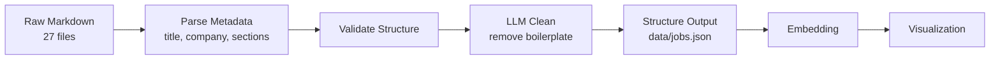

# Data Processing

## Dataset

Job postings were manually collected from LinkedIn by copying content into markdown files. Each file preserves the original posting structure including headers and bullet points.

| Property | Value |
|---|---|
| Source | LinkedIn job postings |
| Count | 27 postings |
| Format | Markdown (`data/selected-job-postings/*.md`) |
| Storage | Structured JSON (`data/jobs.json`) |
| Period | July 2026 |

### Role Breakdown

| Role Category | Count |
|---|---|
| Data Scientist | 8 |
| ML Engineer | 5 |
| AI Engineer | 3 |
| Applied Researcher | 2 |
| Other (9 roles) | 9 |

!!! note "Future Expansion"
    LinkedIn no longer serves relevant ML roles at this volume. Collection stopped at 27. Non-ML postings (SWE, PM, DevOps) will be collected later for contrast.

## Processing Pipeline



### Step 1: Metadata Extraction

The `scripts/001_baseline/bootstrap.py` script extracts structured metadata from each posting:

```json
{
    "id": "bmo-associate-data-scientist",
    "title_raw": "Associate Data Scientist",
    "company": "BMO",
    "source_file": "bmo-associate-data-scientist.md",
    "role_category": "Data Scientist",
    "sections": {
        "about_role": "...",
        "responsibilities": "...",
        "qualifications": "...",
        "nice_to_have": "..."
    },
    "raw_full_text": "..."
}
```

- **Title extraction:** Filename heuristics and explicit text pattern matching
- **Company detection:** Known mapping table plus filename fallback
- **Role categories:** Hand-mapped to 6 categories (Data Scientist, ML Engineer, AI Engineer, Applied/Research, Data Engineer, Other)
- **Section detection:** 23 regex patterns covering common job posting section headers

### Step 2: LLM Cleaning

The `scripts/003_llm_extraction/extract_clean_text.py` script processes each posting through `gpt-5.4-nano` with a system prompt instructing the model to extract only:

- Job responsibilities and day-to-day tasks
- Required qualifications and experience levels
- Technical skills, tools, frameworks
- Education requirements

Content systematically removed: company descriptions, salary/compensation, benefits, EEO statements, recruiter notes, office locations, and employee testimonials.

### Step 3: Semantic Partitioning (New)

Experiment 005 introduced a two-pass LLM partitioning approach that separates job postings into two semantic dimensions:

- **Job-context** (Pass A): duties, skills, and qualifications — "what is this job?"
- **Role-context** (Pass B): team mission, role scope, organizational impact — "what purpose does this role serve?"

Both passes use `gpt-5.4-nano` with distinct system prompts, preserving original wording verbatim. Job-context extraction achieves high fidelity (mean Jaccard 0.9720 vs golden); role-context shows moderate fidelity (mean Jaccard 0.7851). The two partitions are semantically disjoint (mean overlap 0.1932) and collectively exhaustive (mean coverage 0.9653) of the source text.

### Step 4: Quality Validation

The `scripts/003_llm_extraction/eval_cleaning.py` script evaluates LLM output against 5 hand-cleaned golden set reference texts using:

| Metric | Definition |
|---|---|
| Jaccard similarity | Intersection of LLM and golden words / union |
| Boilerplate detection | Regex patterns for salary, benefits, EEO, testimonials |
| Hallucination detection | Words in LLM output not present in source text |
| Over-deletion rate | Golden words removed by LLM / total golden words |

See [Evaluation](evaluation.md) for detailed metric definitions and results.

## Data Quality

### Current State

- No duplicates detected in 27 postings
- All postings have non-empty `about_role`, `responsibilities`, and `qualifications` sections
- LLM over-deletion of organizational context (19–39%) — team role descriptions are inconsistently stripped
- Title-based role labels are noisy — function-based labels (12 categories) planned for honest clustering evaluation

### Planned Improvements

- Function-based role labels capturing what the job actually does, not what it's called
- System prompt tuning to reduce over-deletion of organizational context
- Two-stage text classification: categorize input into required_skills, responsibilities, org_context, and boilerplate, then selectively embed

## Data Augmentation Pipeline

!!! info "Planned — Phase 1.10"

Template-based synthetic posting generation to densify the embedding space. 27 seed postings → ~350+ synthetic variants.

### Slot Vocabularies

| Slot | Values |
|---|---|
| Seniority | Junior, Mid-level, Senior, Staff, Lead, Principal |
| Tech Stack | PyTorch, TensorFlow, JAX, scikit-learn, XGBoost |
| Cloud | AWS, GCP, Azure |
| Role | ML Engineer, Data Scientist, MLOps Engineer, Research Scientist, NLP Engineer |
| Verbs | build, deploy, train, evaluate, optimize, maintain |

### Constraints

- Semantically realistic seniority-skill combinations (no "Junior requiring 10 years of Rust")
- Tagged with `is_synthetic: true` in metadata for transparency
- Limited to ~50 variants per seed to avoid combinatorial explosion
- Manual spot-check of 5-10 variants for realism before full generation
