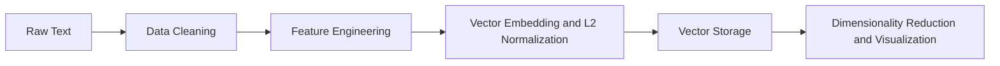

# Embedding Pipeline

## Overview

The embedding pipeline converts raw job posting text into dense 384-dimensional vector representations suitable for semantic similarity search.



## Preprocessing

### Text Normalization

- Whitespace collapsing: multiple spaces, tabs, and newlines reduced to single spaces
- Unicode normalization: NFKC normalization for consistent character encoding
- Case preservation: `all-MiniLM-L6-v2` is trained on cased text — lowercasing is skipped

### Boilerplate Removal

Non-essential content is removed using LLM-based extraction (gpt-5.4-nano). The system prompt instructs the model to strip company descriptions, salary ranges, benefits, EEO statements, and recruiter notes — while preserving job duties, technical skills, and qualifications verbatim.

This approach replaced brittle regex-based cleaning (Experiment 002) with a more robust method (Experiment 003) that achieved an 8.2× improvement in separation gap over raw text.

!!! info "LLM Extraction Results"
    Zero hallucinations across 5 gold-standard postings. Zero boilerplate detected. Over-deletion of organizational context (19–39%) is the primary area for improvement.

### Skill Extraction (Planned)

A curated vocabulary of ~200 ML/DS/AI domain terms will be extracted using spaCy `PhraseMatcher`:

- Languages: Python, R, SQL, Scala, Java, C++
- ML Frameworks: PyTorch, TensorFlow, JAX, scikit-learn, XGBoost, Transformers
- ML Techniques: Deep Learning, Reinforcement Learning, NLP, Computer Vision, Generative AI, LLM
- Infrastructure: AWS, GCP, Azure, Docker, Kubernetes, MLflow, Spark, Airflow

## Embedding Model

### all-MiniLM-L6-v2

| Property | Value |
|---|---|
| Architecture | 6-layer MiniLM (distilled from BERT) |
| Dimensions | 384 |
| Model size | ~80 MB |
| Training data | 1B+ sentence pairs |
| Optimization target | Semantic similarity |
| Default pooling | Mean pooling with attention mask |
| Inference speed | ~20 ms per posting (CPU) |
| Context window | 256 tokens |

### Model Selection Rationale

| Model | Dimensions | Size | CPU Latency | Selected? |
|---|---|---|---|---|
| all-MiniLM-L6-v2 | 384 | 80 MB | ~20 ms | ✓ |
| bge-small-en-1.5 | 384 | 133 MB | ~28 ms | |
| mpnet-base-v2 | 768 | 438 MB | ~40 ms | |

A single model was chosen deliberately to reduce scope. Feature engineering (preprocessing, weighting, normalization) was prioritized over multi-model benchmarking.

## Post-Processing

### L2 Normalization (Critical)

Every vector is normalized to the unit sphere after embedding. This is the single most impactful post-processing step.

```python
def l2_normalize(vecs: np.ndarray) -> np.ndarray:
    norms = np.linalg.norm(vecs, axis=1, keepdims=True)
    return np.where(norms > 0, vecs / norms, vecs)
```

After normalization, cosine similarity reduces to dot product — the fastest similarity metric. It also prevents magnitude imbalance where longer documents rank above short but highly relevant ones. Applied at both write time (indexing) and query time.

!!! warning "Verify Normalization"
    Library defaults vary. `sentence_transformers` normalizes only with `normalize_embeddings=True`. Check with `np.linalg.norm(vecs[0])` — should be ~1.0.

### Mean Centering (Planned)

Subtract the training-set mean from all vectors. Reduces dominance of common boilerplate directions in the embedding space. The mean must be computed on the training split only and applied identically to all other data.

### PCA Whitening (Deferred)

Rotates embeddings into principal-component space and divides by sqrt variance. Deferred due to poor sample-to-dimension ratio (27 samples vs 384 dimensions — whitening amplifies noise in low-variance components). Safer variant planned: top-k components with shrinkage regularization.

## Implementation

From `scripts/003_llm_extraction/compare_variants.py:49–54`:

```python
def embed_texts(texts: list[str], model: SentenceTransformer) -> np.ndarray:
    return model.encode(
        texts,
        normalize_embeddings=True,
        show_progress_bar=False,
    ).astype(np.float32)
```

## Section Weighting Strategies (Planned)

Section weighting addresses a structural problem: a posting's `title` (3–10 words) and `skills` (10–30 words) carry disproportionate discriminative signal, but the verbose `description` (100–500 words) dominates the embedding when concatenated flatly.

### Variant A: Weighted Concatenation (3× title, 2× skills)

```python
weighted_text = (
    f"[TITLE] {job['title_canonical']} " * 3
    + f"[SKILLS] {' '.join(job['skills_required'])} " * 2
    + f"[RESPONSIBILITIES] {job['sections']['responsibilities']} "
    + f"[QUALIFICATIONS] {job['sections']['qualifications']}"
)
```

### Variant B: Conservative Weighting (2× title, 2× skills)

Same structure with reduced repetition to stay within token limits.

### Variant C: Multi-Field Embedding + Vector Fusion

```python
emb_title = model.encode(job["title_canonical"], normalize_embeddings=True)
emb_skills = model.encode(" ".join(job["skills_required"]), normalize_embeddings=True)
emb_body = model.encode(
    job["sections"]["responsibilities"] + " " + job["sections"]["qualifications"],
    normalize_embeddings=True,
)
emb = 0.4 * emb_title + 0.3 * emb_skills + 0.3 * emb_body
emb = emb / np.linalg.norm(emb)
```

!!! tip "Token Limit Awareness"
    Weighted concatenation can exceed MiniLM's 256-token context window. Variant C (multi-field fusion) avoids this by embedding each field separately.
