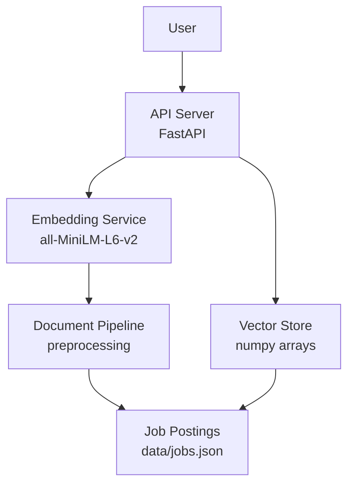

# Architecture

## System Overview



## Components

| Component | Responsibility | Implementation |
|---|---|---|
| Data Pipeline | Cleaning, section extraction, skill tagging | `scripts/`, `backend/preprocessing.py` |
| Embedding Model | Dense text representations (384d) | `sentence-transformers/all-MiniLM-L6-v2` |
| Vector Index | Cosine similarity search | NumPy arrays (L2-normalized) |
| API | User interface for queries and uploads | FastAPI, `backend/api.py` |
| Evaluation | Metrics computation, experiment tracking | `scripts/comp_embedding_variants.py` |
| Data Store | Job posting storage, metadata | JSON files in `data/` |

## Data Flow

1. **Documents ingested** from LinkedIn (27 postings, markdown files)
2. **Text parsed** into structured sections: title, company, responsibilities, qualifications, skills
3. **Text cleaned** via LLM extraction (remove boilerplate: company culture, benefits, EEO statements)
4. **Embeddings computed** (all-MiniLM-L6-v2, L2-normalized to unit norm)
5. **Vectors stored** in NumPy arrays for fast cosine similarity
6. **Queries processed**: text → embedding → dot product → ranked results

## Repository Structure

```
semantic-career-map/
├── backend/                    # FastAPI app, embeddings, retrieval
│   ├── api.py                  # Planned
│   ├── embeddings.py           # Embedding generation + L2 normalization
│   ├── retrieval.py            # Planned: similarity search + precision@k
│   ├── preprocessing.py        # Planned: text prep, skill extraction, weighting
│   └── resume_parser.py        # Planned
├── data/                       # Job postings, embeddings, golden set
│   ├── jobs.json               # Normalized job postings (27)
│   ├── jobs_augmented.json     # Planned: real + synthetic postings
│   ├── embeddings.npy           # Precomputed embeddings
│   ├── golden_cleaned.json     # Hand-cleaned reference texts
│   └── selected-job-postings/  # 27 raw markdown postings
├── scripts/                    # Data pipeline, experiments, evaluation
│   ├── parse_and_embed_quickstart.py
│   ├── comp_embedding_variants.py
│   ├── extract_clean_text.py
│   ├── eval_llm_cleaning.py
│   └── augment_jobs.py         # Planned
├── tests/                      # pytest tests
├── site/                       # This documentation site
├── docs/                       # Planning and research documents
├── pyproject.toml              # Python dependency management (uv)
└── zensical.toml               # Zensical site configuration
```

## Design Decisions

### Why cosine similarity on L2-normalized vectors?

After L2 normalization, cosine similarity reduces to dot product — the fastest similarity metric on every vector engine. Unnormalized vectors distort similarity by vector magnitude: longer documents produce higher-magnitude embeddings, causing short but highly relevant documents to rank below verbose but weakly relevant ones. Normalizing both at write time (indexing) and query time eliminates this bias.

### Why all-MiniLM-L6-v2?

- **384 dimensions** — smallest viable embedding space that preserves semantic similarity
- **80 MB model size** — fits in any deployment context without model registry infrastructure
- **~20 ms inference on CPU** — well below user-perceptible threshold
- **Proven on semantic similarity tasks** — 1B+ sentence pairs training data

### Why precomputed embeddings?

Generated once during setup, not at inference time. Faster queries, simpler deployment. Job postings are static — real-time re-embedding adds latency with no benefit. The embedding matrix is loaded into memory at startup and queried via dot product.

### Why stateless API?

No user accounts, no persistence layer. Reduces deployment complexity and operational surface area. Every request is self-contained — the user sends text, the API returns results. Can be extended with persistence if needed later.

### Why CPU-only?

`all-MiniLM-L6-v2` encodes a posting in ~20 ms on CPU — well below any user-perceptible threshold. GPU adds cost and complexity without meaningful query-time benefit at this scale. GPU would matter if a cross-encoder reranker were added to the retrieval pipeline (deferred to future work).
