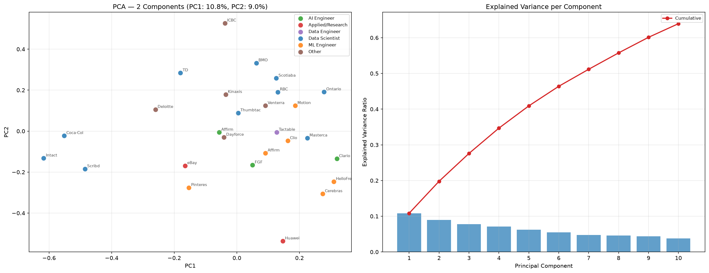

# Experiment 001 — Baseline Embedding Pipeline

**Date:** July 22, 2026

## Question

Can a shared semantic embedding space separate ML job postings by role category using raw, unprocessed text?

## Hypothesis

Raw job posting text (including boilerplate: company culture, benefits, EEO statements) embedded via `all-MiniLM-L6-v2` will show some role-based clustering, but noise from non-essential content will dilute the discriminative signal.

## Setup

| Property | Value |
|---|---|
| Data | 27 job postings from LinkedIn, pasted into markdown files |
| Embedding model | `all-MiniLM-L6-v2`, 384-dimensional, L2-normalized |
| Script | `parse_and_embed_quickstart.py` |
| Visualization | PCA (2-component), UMAP (cosine, n_neighbors=5), t-SNE (cosine, perplexity=5) |
| Role categories | Data Scientist, ML Engineer, AI Engineer, Applied/Research, Data Engineer, Other |

## Results

### PCA

- Weak clustering of ML Engineer roles (orange)
- Data Scientist roles (blue) spread broadly — title ambiguity where "Data Scientist" spans SQL analytics to production ML
- AI Engineer roles (green) show clustering near (0.15, -0.1)
- "Other" roles too heterogeneous for meaningful analysis

### UMAP

- AI Engineer roles form a distinct cluster — agentic work carries distinct semantic signal
- Research roles widely separated: eBay (search ranking) vs Huawei (multimodal AI)
- Data Scientist roles show more clustering structure along UMAP axis 2
- Notable: eBay search ranking adjacent to Pinterest ML Engineer — both involve search ranking

### t-SNE

- Weakest visualization — t-SNE preserves local structure but distorts global relationships
- Data Scientist roles exhibit greatest clustering, arranged in a circle around (0, -40)
- eBay-Pinterest semantic pairing persists across all three visualizations

## Identification of Noise Sources

| Noise Source | Impact |
|---|---|
| Company culture sections | Postings from similar cultures cluster regardless of role |
| Salary and benefits boilerplate | Common across postings, false clustering signal |
| EEO/diversity statements | Structurally identical, contaminates cosine similarity |
| Team descriptions | Introduces organizational rather than functional similarity |
| Title ambiguity | "Data Scientist" spans 5+ distinct job functions |

## Interpretation

The raw text embedding produces meaningful but noisy clusters. Three key problems:

1. **Boilerplate contaminates the embedding.** Non-essential sections (About Us, Company Culture) are embedded alongside job responsibilities, causing embeddings to cluster on company culture style rather than technical role requirements.

2. **Role labels are noisy.** "Data Scientist" at Coca-Cola (demand modeling) and Scribd (NLP models) share a label but are fundamentally different roles.

3. **Small sample size limits generalizability.** 27 postings cannot capture the full diversity of AI/ML roles.

## Engineering Decision

**Adopt a preprocessing step** to extract only the responsibilities and requirements sections, excluding boilerplate. This directly leads to Experiment 002.

!!! note "Image References"
    Plot images are generated by `parse_and_embed_quickstart.py` and stored in `site/assets/images/`.
