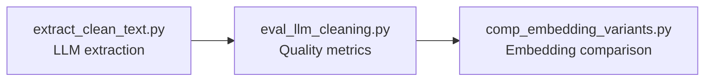
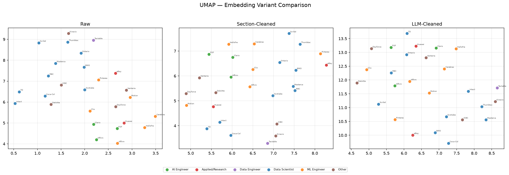

# Experiment 003 — LLM-Based Text Extraction

**Date:** July 23, 2026

## Question

Can an LLM automatically extract relevant job posting sections from unstructured text, outperforming regex-based boilerplate removal?

## Hypothesis

LLM-based extraction will produce cleaner text than regex methods, improving embedding quality while avoiding brittle pattern matching.

## Setup

### Pipeline Architecture

### Script 1: `extract_clean_text.py`

LLM: gpt-5.4-nano. System prompt instructs the model to strip company descriptions, compensation, benefits, EEO statements, and recruiter notes — while preserving job duties, technical skills, qualifications, and original wording verbatim.

### Script 2: `eval_llm_cleaning.py`

Evaluates against 5 hand-cleaned golden set reference texts (`data/golden_cleaned.json`) using four metrics:

| Metric | Definition | Target |
|---|---|---|
| Jaccard similarity | LLM ∩ golden / LLM ∪ golden (word-level) | Higher |
| Boilerplate detection | Regex for salary, benefits, EEO, testimonials | CLEAN |
| Hallucination detection | Words in LLM output not in source text | CLEAN |
| Over-deletion rate | Golden words removed / total golden words | Lower |

### Script 3: `comp_embedding_variants.py`

Compares all three text variants (raw, section-cleaned, LLM-cleaned) using identical embedding and evaluation pipelines with self-retrieval, separation gap, and UMAP visualization.

## Results

### Per-Model Extraction Quality

| Posting | Jaccard vs Golden | Boilerplate | Hallucinations | Over-deletion |
|---|---|---|---|---|
| BMO Data Scientist | 0.801 | CLEAN | CLEAN | 19.9% |
| **Affirm ML Engineer 2** | **1.000** | CLEAN | CLEAN | **0.0%** |
| HelloFresh ML Engineer | 0.775 | CLEAN | CLEAN | 22.5% |
| Mastercard Data Scientist 2 | 0.610 | CLEAN | CLEAN | 29.9% |
| Scribd Data Scientist 2 | 0.614 | CLEAN | CLEAN | 38.6% |

**Key findings:**

- Zero hallucinations across all 5 postings
- Zero boilerplate detected — salary, benefits, EEO completely removed
- Variable over-deletion driven by organizational context density

### Embedding Comparison

| Variant | Self-Retrieval | Separation Gap | Mean CosSim |
|---|---|---|---|
| Raw (`raw_full_text`) | 100.0% | +0.0060 | 0.4045 |
| Section-Cleaned (`clean_text`) | 100.0% | +0.0203 | 0.4298 |
| **LLM-Cleaned (`llm_clean_text`)** | **100.0%** | **+0.0493** | 0.5280 |

LLM-cleaned text achieves:

- **8.2× improvement** over raw text (0.0060 → 0.0493)
- **2.4× improvement** over regex-based cleaning (0.0203 → 0.0493)
- **100% self-retrieval** across all variants

### Cross-Posting Pattern

| Consistently Preserved | Consistently Removed | Inconsistently Removed |
|---|---|---|
| Job responsibilities | Salary, compensation, benefits | Organizational context (team role, product area) |
| Required qualifications | EEO/diversity statements | |
| Technical skills (Python, SQL, Spark, PyTorch) | Recruiter notes | |
| Education requirements | Company culture, mission | |
| Experience levels | Office locations, remote policy | |

## Interpretation

LLM-based extraction is the best approach tested:

- 8.2× separation gap improvement over raw text
- Zero hallucinations — the LLM never invents content
- Comprehensive boilerplate removal
- Consistent preservation of technical requirements and responsibilities

Two areas for improvement:

1. **System prompt tuning:** The prompt instructs the LLM to strip team descriptions, but organizational context carries semantic signal. A revised prompt should distinguish between organizational role context (preserve) and team culture descriptions (strip).

2. **Two-stage extraction:** Classify text into categories (required_skills, responsibilities, org_context, boilerplate), then selectively embed the relevant ones. This preserves organizational context without contaminating embeddings.

## Engineering Decision

**Adopt LLM-based extraction as the primary text cleaning method.** gpt-5.4-nano provides sufficient quality at this scale. Follow-ups planned:

1. System prompt tuning to reduce over-deletion of organizational context
2. Proxy metrics formalization and golden set construction for pytrec_eval evaluation

!!! note "Image References"
    UMAP comparison plots generated by `comp_embedding_variants.py` and stored in `site/assets/images/`.
